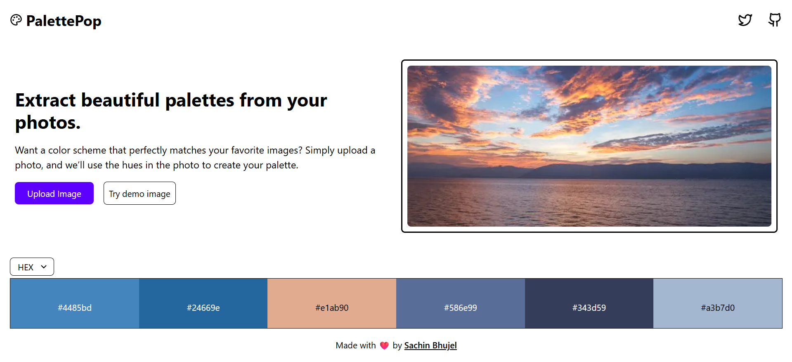

# 🎨 PalettePop

A simple and interactive web app that generates color palettes from any image you upload.

---

## 🚀 Features

-   🖼️ Upload any image (JPG, PNG, etc.)
-   🎨 Instantly get a color palette based on your image
-   📋 Copy color codes with one click
-   🌈 The UI changes dynamically based on the generated colors
-   💡 Responsive and easy-to-use interface

---

## 📷 Screenshots

---

## 🧩 Tech Stack

-   **Next.js** – Frontend framework
-   **Tailwind CSS** – For clean and responsive styling

---

## ⚙️ How It Works

1. Upload your image using the upload button.
2. The app processes your image and extracts its dominant colors.
3. You can view the palette and copy the color codes easily.

---

## 🤝 Contributing

Contributions, issues, and feature requests are welcome! Feel free to open an issue or submit a PR.
